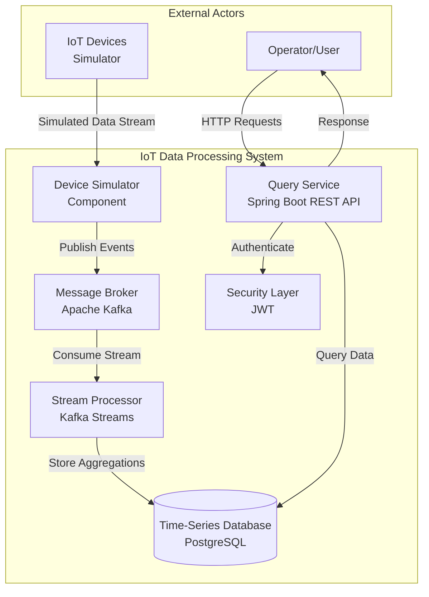
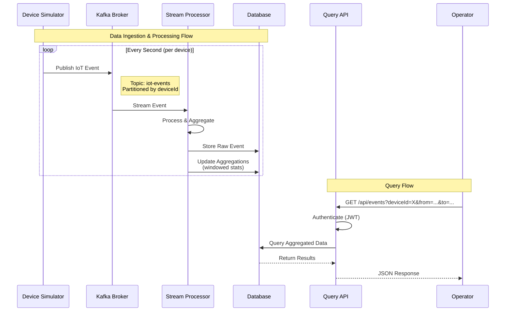

# IoT Data Processing System - Architectural Decisions

## Architectural Pattern

I went with an **Event-Driven Stream Processing Architecture**. The main reason is that IoT devices generate continuous data streams, and this pattern handles that naturally. Components communicate asynchronously through events, which means we can scale each part independently and add new device types without touching existing code. If something breaks, messages aren't lost because they're stored in the broker.

The key principles here are:
- Devices send data asynchronously to a message broker
- Data gets processed in real-time as it arrives
- Raw events are stored for historical queries
- Write path (streaming) is separate from read path (query service)

## Technology Stack

### Message Broker: Apache Kafka
Kafka is the industry standard for event streaming. It handles high throughput, has built-in partitioning for scalability, and keeps messages around for replay. For the prototype, we'll use it in embedded mode so there's no separate cluster to manage.

I considered RabbitMQ, but it's not really built for streaming workloads. An in-memory queue would be simpler, but we'd lose data on restart, which doesn't meet the persistence requirement.

### Stream Processing: Kafka Streams
Kafka Streams is a Java library that runs in-process, so no separate cluster needed. It has built-in state stores for aggregations and handles exactly-once processing. Perfect for a self-contained prototype.

I looked at Apache Flink, but it requires a separate cluster and is overkill for this. A custom processor would mean implementing state management and exactly-once semantics from scratch, which is reinventing the wheel.

### Storage: PostgreSQL with TimescaleDB
For time-series IoT data, there are actually some NoSQL options that could work well. InfluxDB is specialized for time-series workloads and has excellent performance for this use case. Apache Cassandra is another option - it's a wide-column store that handles time-series data well with its partitioning model.

However, we're sticking with PostgreSQL and the TimescaleDB extension for simplicity. Most Java developers are familiar with SQL, and Spring Data JPA works seamlessly with PostgreSQL. The TimescaleDB extension gives us time-series optimizations like hypertables and continuous aggregates, which is enough for this prototype. If we need to scale later, we can always migrate to InfluxDB or Cassandra, but for now PostgreSQL keeps things straightforward.

### API Framework: Spring Boot
Spring Boot is the industry standard for Java web services. It has a rich ecosystem, excellent documentation, and built-in security. The slight overhead is worth it for the ecosystem and community support.

I considered Quarkus and Micronaut for faster startup, but their ecosystems are smaller and less familiar to most developers. Plain Java would mean implementing everything ourselves, which is too much boilerplate.

### Security: JWT Tokens
JWT tokens are stateless and scalable, which works well for a REST API. Spring Security handles this out of the box. For a minimal prototype, we could fall back to Basic Auth, but JWT is the better long-term choice.

OAuth2 would be overkill for this prototype.

## Key Trade-offs

**Kafka complexity vs. simplicity**: Kafka has a steeper learning curve than RabbitMQ, but it's built for streaming. Using embedded mode mitigates the setup complexity.

**Kafka Streams vs. Flink**: Flink is more powerful but requires a separate cluster. Kafka Streams runs in-process and has everything we need for this use case.

**PostgreSQL vs. NoSQL**: InfluxDB or Cassandra might be better optimized for time-series data, but PostgreSQL with TimescaleDB is simpler to work with. SQL is familiar to most developers, and Spring Data JPA integration is straightforward. We can always migrate to a specialized time-series database later if needed.

**Spring Boot overhead**: Spring Boot can be heavy, but the ecosystem and tooling make it worth it. The startup time difference isn't critical for a prototype.

## Architecture Diagrams

### Context View



### Data Flow



## Docker Compose Setup

The system uses Docker Compose to run all components together. The setup includes:

- **Zookeeper**: Required for Kafka coordination
- **Kafka**: Message broker running on port 9092
- **PostgreSQL with TimescaleDB**: Time-series database on port 5432
- **Application**: Spring Boot application on port 8080

To start everything:

```bash
docker-compose up -d
```

The application will automatically connect to Kafka and PostgreSQL once they're healthy. Kafka topics will be auto-created when the application starts.

To stop everything:

```bash
docker-compose down
```

Add `-v` to remove volumes: `docker-compose down -v`

## Known Limitations

This is a prototype, so there are some limitations:
- Single-node Kafka setup (not distributed)
- Basic JWT implementation without refresh token rotation
- No comprehensive monitoring or observability
- Basic error handling without dead-letter queues
- PostgreSQL might not scale as well as specialized time-series databases like InfluxDB for very high write volumes

The migration path to production would involve deploying a multi-node Kafka cluster, potentially migrating to InfluxDB or Cassandra for better time-series performance, adding monitoring, and implementing more robust error handling.
